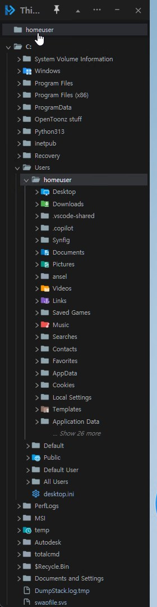
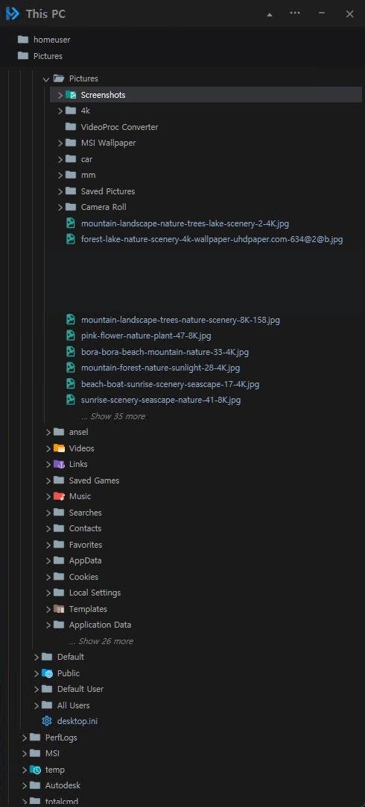
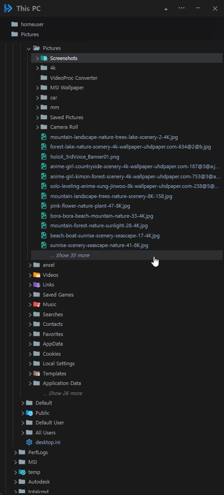
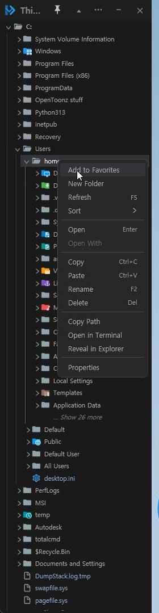
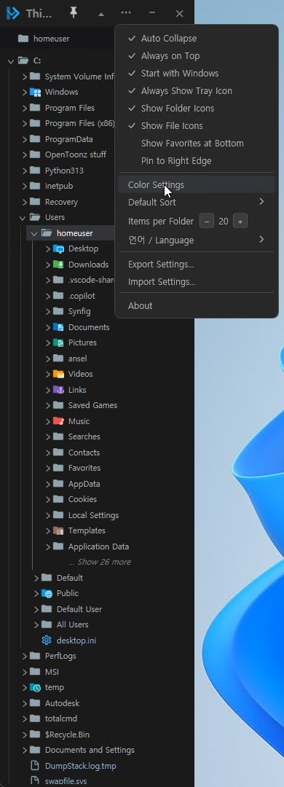
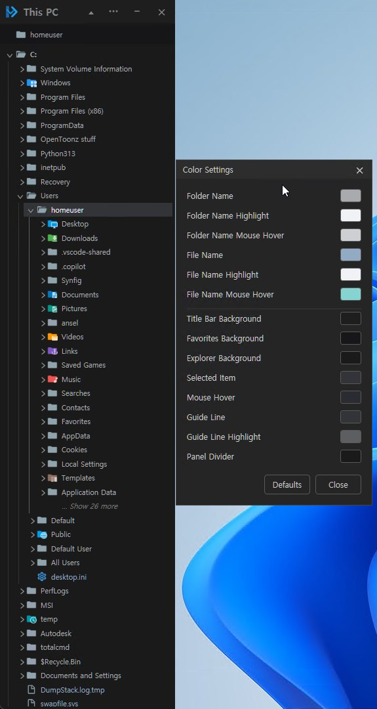

# Edgetree

[English](README.md)

윈도우 화면 좌우에 상시 고정되는, VS Code 탐색기 방식의 가벼운 파일 탐색 유틸입니다.
기본 윈도우 탐색기를 대체하려는 목적이 아니라, 폴더 구조를 빠르게 훑어보고
파일 위치로 바로 이동하기 위한 보조 도구입니다.

## 다운로드

[릴리즈 페이지](https://github.com/legendsteel11-dotcom/Edgetree/releases/latest)에서 최신 버전을 받으세요. 매 릴리즈마다 파일 2개가 첨부되어 있습니다.

- **`Edgetree-<버전>-win-x64.exe`** (약 1MB) — [.NET 8 데스크톱 런타임](https://dotnet.microsoft.com/download/dotnet/8.0)이 이미 설치되어 있다면 이걸로.
- **`Edgetree-<버전>-win-x64-standalone.exe`** (약 160MB) — .NET을 따로 설치할 필요 없이 바로 실행되는 단일 파일. 잘 모르겠거나, 작은 exe가 런타임이 없다는 오류를 낸다면 이걸로.

둘 다 설치 프로그램 없이 exe 파일 하나만 실행하면 됩니다.

## 스크린샷

| | |
|---|---|
|  |  |
| 좌측 가장자리 도킹 | 우측 가장자리 도킹 |
|  |  |
| 창모드(넓게)에서 탐색 | 우클릭 컨텍스트 메뉴 |
|  |  |
| 옵션("...") 메뉴 | 색상 설정 |

## 주요 기능

- **화면 가장자리 고정 배치** — 기본은 좌측, 옵션 메뉴에서 우측으로도 전환
  가능 (작업표시줄을 제외한 작업영역 기준 전체 높이), 고정 상태에서는
  Alt+Tab/작업표시줄에서 제외됨
- **접기/펼치기**: 앱 아이콘 클릭 한 번으로 아이콘 바만 남는 접힘 상태로
  전환, 그 상태에서 한 번 더 클릭하면 화면 가장자리에 얇은 바만 남기고
  완전히 숨겨지는 오토하이드 모드로 전환됨 — 마우스를 가장자리로 가져가면
  자동으로 펼쳐지고 벗어나면 다시 조용히 숨겨짐(펼쳐진 상태에서 핀 아이콘을
  누르면 오토하이드를 끄고 고정할 수 있음). 모두 부드러운 폭 애니메이션과
  함께 전환
- **드래그로 폭 조절** (고정 상태에서)
- **자유 이동 창으로 분리**: 상단 헤더를 드래그하면 고정이 풀리면서
  자유롭게 이동/리사이즈 가능한 일반 창으로 전환(이때는 Alt+Tab/작업표시줄에도
  나타남). 헤더의 핀 버튼을 누르거나 헤더를 더블클릭하면 다시 가장자리에
  고정되고 전체 높이로 복원 — 고정/자유이동을 오갈 때마다 직전 창 위치와
  크기를 기억함
- **드라이브 기반 루트("내 PC")**: 연결된 모든 드라이브를 최상위에 나열,
  폴더는 펼칠 때마다 하위 항목을 지연 로딩
- **이전 상태 그대로 복원**: 펼쳐뒀던 폴더들과 마지막으로 선택했던 위치가
  앱을 다시 실행해도 그대로 돌아옴
- **큰 폴더도 빠르게**: 폴더마다 처음 25개 항목만 표시하고 "… 더 보기 (N개)"
  줄로 나머지를 펼침 — 트리가 한 번에 수천 개 행을 그리지 않아, 파일이 아주
  많은 폴더 아래의 즐겨찾기로 이동해도 즉시 반응. 표시 개수는 옵션 메뉴에서
  1~50개로 조절 가능(저해상도 화면 고려)
- **설정 내보내기/가져오기**: 설정을 JSON 파일로 저장하고 다른 PC에서 불러오기
  (즐겨찾기 포함, 해당 PC에 없는 경로는 자동으로 정리됨)
- 폴더 행을 한 번 클릭하면 펼침/접힘 (VS Code처럼 화살표뿐 아니라 줄 전체 클릭
  가능), 파일은 더블클릭으로 기본 연결 프로그램 실행
- **Auto Collapse** (옵션 "..." 메뉴): 아코디언 모드 — 폴더 하나를 펼치면
  그 폴더까지 가는 경로만 남기고 나머지 열려있던 폴더는 자동으로 접힘
- **즐겨찾기 패널**: 헤더 아래에 폴더를 고정해두고, 한 번 클릭하면 트리에서 해당
  경로까지 바로 펼쳐지고(대상 폴더 자신도 함께 펼쳐짐) 트리 맨 위에 오도록
  스크롤됨 — 파일이 아주 많은 폴더 아래에 있거나 다른 드라이브에 있어도 한 번의
  클릭으로 안정적으로 이동. 즐겨찾기 개수에 맞춰 높이가 자동으로 맞춰지고
  (구분선 더블클릭으로 정확히 맞춤도 가능), 트리의 글자 크기 확대/축소도 함께 따라감.
  옵션 메뉴에서 탐색기 위/아래 위치 전환 가능(고정/창모드 모두 적용)
- **인라인 이름 바꾸기** (VS Code 방식): `F2` 또는 우클릭 메뉴로 트리 행에서
  바로 이름을 수정, 별도 팝업 없음. 이미 선택된 **파일**을 잠시 뒤 다시 한 번
  클릭해도 이름 바꾸기 시작(탐색기와 동일). 폴더는 클릭이 펼침/접힘이라 제외 —
  `F2`/우클릭 사용
- **우클릭 메뉴**: 새 폴더, 새로고침, 열기, 연결 프로그램(파일 전용),
  복사/붙여넣기, 이름 바꾸기, 삭제(휴지통으로, 확인창 포함), 경로 복사,
  터미널에서 위치 열기, 탐색기에서 위치 열기(폴더는 그 폴더가 열리고, 파일은
  상위 폴더에서 선택됨), 속성 — 각각 단축키 지원
  (`F2`, `F5`, `Delete`, `Ctrl+C`/`Ctrl+V`, `Enter`) — **이 우클릭 메뉴가
  열려 있는 동안에도 같은 단축키가 그대로 동작**(색상 설정 등 별도 팝업
  창이 열려 있을 때는 해당 없음); 메뉴가 대상 행을 가리지 않도록 항상 그
  아래에 열림
- **파일을 앱 밖으로 드래그** — 탐색기나 다른 앱으로 끌어다 놓기(복사/이동/
  드롭하여 열기 모두 윈도우 표준 방식대로 동작)
- **정렬**: 이름순/날짜순, 오름차순/내림차순 — 옵션("...") 메뉴 또는 폴더
  자신의 우클릭 메뉴에서 바꿀 수 있고, 후자는 그 폴더를 즉시 재정렬해서
  보여줌(다음 번 펼칠 때까지 기다릴 필요 없음)
- **Material Icon Theme** 기반 파일/폴더 아이콘
  ([THIRD-PARTY-NOTICES.md](THIRD-PARTY-NOTICES.md) 참고); 드라이브 이름은
  굵게 표시
- 헤더: 고정, 모두 접기, **옵션("...") 메뉴**(Auto Collapse·항상 위에
  표시·윈도우 시작 시 실행·트레이 아이콘 항상 표시·폴더 아이콘 표시·파일
  아이콘 표시·즐겨찾기 아래 배치·화면 우측에 고정·색상 설정·기본 정렬·폴더의
  표시 개수·언어·설정 내보내기/가져오기·정보 — 모두 설정 저장됨), 트레이로
  최소화, 종료
- **트레이로 최소화**: 트레이 아이콘 클릭(또는 "열기" 메뉴)으로 창 복원,
  우클릭으로 열기/종료
- **색상 설정**: 폴더명/파일명(각각 선택 하이라이트·마우스 hover 색상까지
  별도 지정 가능)·탐색기 배경·즐겨찾기 배경·선택된 항목·마우스 hover
  배경·탭 구분선/하이라이트·제목 표시줄 배경·영역 구분선(제목표시줄/즐겨찾기/
  탐색영역 사이 구분선)까지 총 14개 항목을 윈도우 기본 색상 선택창으로 직접
  지정, 커스텀 팔레트도 항목을 오가며 유지됨, 기본값 복원 버튼 포함
- **한국어/영어 UI 언어** 전환 (옵션 메뉴에서 선택, 적용하려면 앱 재시작)
- **정보 창**: 버전, 제작자, 빌드 날짜, 라이센스 요약(보증 없이 제공된다는
  안내 포함)
- 트리·즐겨찾기 행에 마우스를 올리면 손가락 커서로 바뀜, 헤더 아이콘은 기본
  상태에서 살짝 톤다운되어 있다가 hover 시 밝아짐
- 창모드(자유 이동)일 때 Windows 11 기본 창처럼 모서리가 둥글게 처리됨
- `Ctrl` `+`/`-`로 트리 폰트 크기 확대/축소(9~16pt), `Ctrl+0`으로 기본값 복원 —
  행 간격도 폰트 크기에 비례해서 같이 조절됨(즐겨찾기 패널도 동일하게 적용)
- 선택한 파일의 상위 폴더 들여쓰기 가이드라인이 VS Code처럼 밝게 강조 표시
- 연결 프로그램이 없는 파일은 아무 반응 없이 무시하지 않고, 탐색기와 동일하게
  "어떻게 여시겠어요?" 선택 창으로 대체

## 요구 사항

- Windows 10/11
- [.NET 8 SDK](https://dotnet.microsoft.com/download/dotnet/8.0)
  (소스에서 빌드/실행할 경우)

## 빌드 및 실행

```bash
git clone <this-repo-url>
cd SIDEBARVSCODELIKEEXPLORER
dotnet run --project src/Edgetree
```

솔루션 전체 빌드:

```bash
dotnet build Edgetree.sln
```

## 단일 실행 파일로 배포하기

프레임워크 종속 (용량 작음, 대상 PC에 .NET 8 데스크톱 런타임 필요):

```bash
dotnet publish src/Edgetree -c Release -r win-x64 --self-contained false -p:PublishSingleFile=true
```

독립 실행형 (용량 큼, 대상 PC에 .NET 설치 불필요):

```bash
dotnet publish src/Edgetree -c Release -r win-x64 --self-contained true -p:PublishSingleFile=true -p:IncludeNativeLibrariesForSelfExtract=true
```

`IncludeNativeLibrariesForSelfExtract` 옵션이 핵심입니다 — 이게 없으면 WPF의
네이티브 연동 DLL(`D3DCompiler_47_cor3.dll`, `wpfgfx_cor3.dll` 등)이 exe 안에
포함되지 않고 옆에 따로 풀려서, exe 파일 하나만 옮기면 실행이 안 됩니다.

어느 쪽이든 결과물은 `src/Edgetree/bin/Release/net8.0-windows/win-x64/publish/`
경로에 생성됩니다.

## 라이선스

MIT — [LICENSE.md](LICENSE.md) 참고. 번들된 아이콘은 Material Icon Theme
프로젝트(역시 MIT)에서 가져왔습니다 —
[THIRD-PARTY-NOTICES.md](THIRD-PARTY-NOTICES.md) 참고.

## 개발 과정에 대하여

이 도구는 제작자가 직접 기획하고 다듬었으며, 구현은 Claude Code(Anthropic)와
협업하여 진행했습니다. 기능 결정, UX 설계, 실사용 테스트 모두 매일 직접
사용하면서 나온 결과물입니다.
