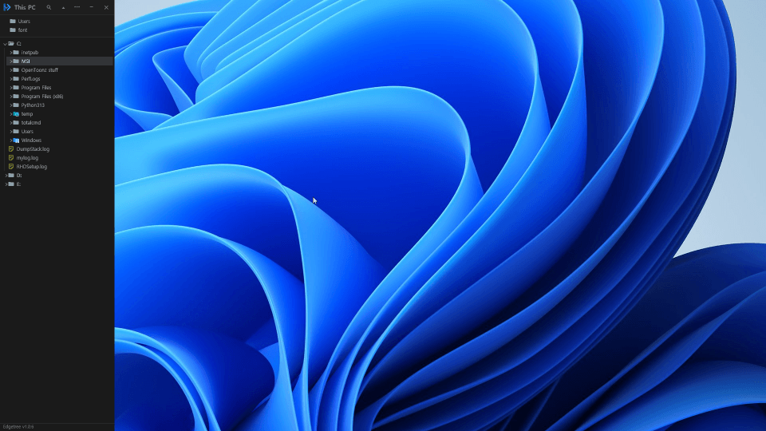

# Edgetree v1.3.4

[한국어 안내](README-ko.md)

https://edgetree.vercel.app/

A lightweight, always-on-hand file explorer for Windows that docks to the left
or right edge of the screen, VS Code Explorer style. It's not meant to replace
Windows Explorer — it's a quick way to glance at a folder structure and jump
straight to a file without opening a full Explorer window.

## Download

Grab the latest build from the [Releases page](https://github.com/legendsteel11/Edgetree/releases/latest). Two options are attached to each release:

- **`Edgetree-<version>-win-x64.exe`** (~1 MB) — pick this if you already have
  the [.NET 8 Desktop Runtime](https://dotnet.microsoft.com/download/dotnet/8.0) installed.
- **`Edgetree-<version>-win-x64-standalone.exe`** (~160 MB) — a single file
  with everything bundled in, no .NET install required. Pick this if you're
  not sure, or if the smaller exe complains about a missing runtime.

Either way, it's one `.exe` — no installer, just run it.

## Screenshots



## Features

### Docking and auto-hide

- **Docks to the screen edge** — left by default, right if you prefer. It
  spans the full working height and stays out of Alt+Tab while docked.
- **Auto-hide with the pin button.** Click the pin and the window shrinks to
  a thin sliver at the edge; move your mouse there and it slides back open.
  The pin lies on its side while auto-hiding — click it again to pin the
  window open.
- **Floating mode.** Drag the header away from the edge to get a normal,
  movable window. The pin snaps it back to the edge, and both modes remember
  their size and position.
- **Resize by dragging**, or double-click the resize line to fit the width
  to the longest visible name.

### The tree

- **Starts at "This PC"** with every drive listed; folders load as you
  expand them, and the app reopens exactly where you left off.
- **Single click expands a folder** (the whole row, VS Code style);
  double-click opens a file.
- **Large folders stay fast.** Each folder shows its first 25 items with a
  "Show N more" row for the rest, so the tree never renders thousands of
  rows at once. The cap is adjustable (1–50).
- **Multi-select** with `Ctrl+click` and `Shift+click`, then copy, delete,
  or drag the whole selection out in one go.
- **Auto Collapse** (optional): expanding a folder closes the others, so
  only the path you're on stays open.
- **Inline rename** with `F2`, right in the row — no popup. Clicking an
  already-selected file again after a pause works too, like Explorer.
- **Sorting** by name or date, ascending or descending — globally, or per
  folder from its right-click menu.
- **Bookmarks** (`Ctrl+Alt+K`): mark rows you keep coming back to and cycle
  through them with `Ctrl+Alt+L` / `Ctrl+Alt+J`.
- **Live updates**: changes made outside the app (new, renamed, or deleted
  files) show up in the tree on their own.

### Files and the right-click menu

- **A full right-click menu**: new folder, open, open with, copy/paste,
  compress, rename, delete to the Recycle Bin, copy path, open in terminal,
  reveal in Explorer, properties — with the usual shortcuts (`F2`, `F5`,
  `F7`, `Delete`, `Ctrl+C`/`Ctrl+V`, `Enter`).
- **Compress to zip** from the same menu, and unpack a `.zip` with Extract.
- **Image preview.** Right-click an image and a thumbnail appears at the top
  of the menu, with its format, pixel size, file size, and modified date.
  Click the thumbnail to open the file.
- **Drag files out** into Explorer or any other app — a standard Windows
  file drag.

### Favorites and search

- **Favorites panel**: pin your folders and jump to any of them with one
  click — the tree expands and scrolls straight there, even across drives.
- **Folder search** (`Ctrl+F`): pick a folder and find files by name, with
  substring or `*`/`?` wildcard matching. Results are grouped by folder;
  click one to jump to it in the tree, or drag it into another app.
- **The index is saved**, so a folder you've searched before is ready
  instantly on the next launch — on a NAS this turns minutes of indexing
  into about a second. Searching works while indexing is still running.

### Looks and settings

- **Two icon styles**: the same icons Windows Explorer shows (default), or
  the bundled [Material Icon Theme](THIRD-PARTY-NOTICES.md) set.
- **15 customizable colors**, with separate dark and light palettes and a
  one-click reset.
- **Font size** (`Ctrl` `+`/`-`, 9–20pt), indent width, row spacing, and
  scrollbar width are all adjustable — icons and menus scale along.
- **Sharp at any display scale** (125%, 150%, 200%…): rendered at the
  actual scale instead of being stretched.
- **Korean and English UI.**
- **Settings export/import** as a JSON file, favorites included.
- The rest lives in the options ("...") menu: start with Windows, always on
  top, minimize to tray, update notification, and more. An update dot on the
  options button tells you when a new release is out.

## Requirements

- Windows 10/11
- [.NET 8 SDK](https://dotnet.microsoft.com/download/dotnet/8.0) (to build/run
  from source)

## Building & running

```bash
git clone <this-repo-url>
cd Edgetree
dotnet run --project src/Edgetree
```

Or build the whole solution:

```bash
dotnet build Edgetree.sln
```

## Publishing a standalone executable

Framework-dependent (small, needs the .NET 8 Desktop Runtime on the target machine):

```bash
dotnet publish src/Edgetree -c Release -r win-x64 --self-contained false -p:PublishSingleFile=true
```

Self-contained (large, no .NET install needed on the target machine):

```bash
dotnet publish src/Edgetree -c Release -r win-x64 --self-contained true -p:PublishSingleFile=true -p:IncludeNativeLibrariesForSelfExtract=true
```

`IncludeNativeLibrariesForSelfExtract` matters here — without it, WPF's native
interop DLLs (`D3DCompiler_47_cor3.dll`, `wpfgfx_cor3.dll`, etc.) get dropped
loose next to the exe instead of bundled into it, so the exe stops working the
moment it's moved on its own.

Either way, the resulting `.exe` is in
`src/Edgetree/bin/Release/net8.0-windows/win-x64/publish/`.

## Changelog

### v1.3.4 (2026-07-30)

- **Cut**: cut with the right-click menu or Ctrl+X and paste into another folder
  to move rather than copy. It uses the same clipboard convention Explorer does,
  so cutting in one and pasting in the other works either way round. Cut rows
  keep a faded icon and an italic name, so it stays clear what is on its way out
- **The search list says when it is out of date**: a blue dot appears on the
  reindex button once a file has been added or removed inside the folder you are
  searching. Reindexing clears it
- **Icon licence notices**: About now names where the file and folder icons
  (Material Icon Theme) and the interface glyphs (Google's Material Symbols) come
  from, with their licences. The app carries the full Apache License 2.0 text and
  opens it from that window
- **Every click on a folder registers**: clicking a folder open and shut in quick
  succession could leave one of those clicks without effect. It always counts now
- Reindex moved to the right of the results line, and the search history list now
  uses the same scrollbar as the rest of the app

### v1.3.3 (2026-07-28)

- **Bookmark list**: the options menu now shows every bookmark you have set.
  Click one to go there — the list stays open, so several can be checked in a
  row — drop one with the "−" at the end of its row, or clear them all from the
  bottom. The shortcuts are spelled out underneath
- **Search sorting opens a menu**: folder grouping, name or date modified, and
  the direction, all named. No more clicking through five states to reach the
  last one
- **Color Settings and About follow the font**: what Ctrl +/- does to the tree
  now reaches those windows too, swatches included
- **Works with an auto-hidden taskbar**: moving the cursor to the bottom edge
  brings the taskbar up as it should
- Clicking the space between the title bar icons no longer undocks the window
- The last favorite is no longer clipped after a restart
- The +/− steppers in the options menu stay centred at any font size

### v1.3.2 (2026-07-26)

- **Drag onto the hidden edge to open it**: drag a file from another window,
  rest it on the thin bar at the screen edge for a moment, and the sidebar
  opens so you can drop it on the folder you want. Brushing past leaves it
  closed
- **Network drives (NAS and the like) hold up**: the window keeps working
  when a mapped drive stops answering. The drive keeps its place in the tree
  instead of vanishing, greys out with its folders folded away, and comes
  back on its own once the drive does
- **Sort by type or size**, alongside name and date modified — per folder or
  as the app-wide default. Clicking a row's sort icon opens that folder's
  sort menu directly
- **Reorder favorites** by dragging them, and hover one to see its full path
  when several folders share a name
- **Bookmarks tidy themselves**: a bookmark on a file or folder that has been
  deleted is dropped, while bookmarks on a drive that isn't answering are
  left alone
- The About window now links to the maker's other tool, TabStick

### v1.3.1 (2026-07-25)

- **Always on top**: now in effect from the moment the app starts, and an
  auto-hidden sidebar can no longer end up behind another window with its
  sliver unresponsive
- **Favorites**: clicking a favorite you are already on brings that folder
  back to the top, however far the tree has been scrolled since
- **Items per folder**: the stepper responds immediately as you click through
  it

### v1.3.0 (2026-07-25)

- **Bookmarks**: mark a file or folder (`Ctrl+Alt+K`) and cycle through your
  marks (`Ctrl+Alt+L` / `Ctrl+Alt+J`) — marks survive restarts
- **Compress and extract**: zip the selection from the right-click menu
  (several items become one archive), and unpack a `.zip` into a folder of
  the same name
- **New folder shortcut**: `F7`
- **Faster scrolling**: hold `Ctrl` while scrolling the tree
- **Network drive badge**: folders on a network drive carry a small mark on
  their icon
- **Expanded folders stay open**: pasting, deleting, renaming, or dropping
  files in keeps the folders you had open and the place you were looking at
- **Dropping onto a file row** puts the files in that file's folder, the
  same as paste
- Right-click menu spacing tuned for low-resolution screens; adding a
  favorite no longer resizes the favorites panel

### v1.2.2 (2026-07-23)

- **Network drives behave better**: a drive that is asleep or briefly
  unreachable keeps its place in the tree and expands normally once it
  responds
- **Update download link**: when a newer release is available, the About
  window now shows a direct download link under the version
- Update-notification dot placement polish

### v1.2.1 (2026-07-23)

- **Image preview in the right-click menu**: a thumbnail with format, pixel
  size, file size, and modified date — click it to open the file
- **The pin is now a pinned/auto-hide toggle**: click to auto-hide (the pin
  lies down), click again to pin open (it stands back up) — replaces the old
  app-icon click
- **Menus follow the font zoom**: right-click/options menu text and spacing
  now scale with the tree's Ctrl `+`/`-` zoom, with tightened row rhythm
- **Windows Explorer icons are now the default** (the Material set remains an
  option)
- **Update notification**: a small dot on the options ("...") button when a
  newer release is available
- **Better behavior while you work elsewhere**: the selection highlight dims
  while the app is in the background, and inline rename no longer carries
  across app switches
- **Fresher folder contents**: re-expanding a collapsed folder now reflects
  changes made in the meantime, and external add/delete updates redraw more
  steadily
- Multi-select (Shift+click ranges) and right-click interaction polish;
  color settings now save immediately

### v1.2.0 (2026-07-21)

- **Multi-select**: Ctrl/Shift+click several files or folders to copy,
  delete, or drag them out together
- **Icon style option**: the same icons Windows Explorer shows

Earlier versions are covered on the
[GitHub releases page](https://github.com/legendsteel11/Edgetree/releases).

## Requests & bug reports

Email pjh85336@gmail.com.

## Another tool by the same maker

[TabStick](https://tabstick.com/) — index notes that stick beside
the window they belong to.

## License

MIT — see [LICENSE.md](LICENSE.md). File and folder icons come from the Material
Icon Theme project (MIT) and the interface glyphs from Google's Material Symbols
(Apache License 2.0) — see [THIRD-PARTY-NOTICES.md](THIRD-PARTY-NOTICES.md), and
the Apache licence text the app itself carries at
[src/Edgetree/Resources/APACHE-2.0.txt](src/Edgetree/Resources/APACHE-2.0.txt).

## About Development

This tool was designed and iterated on by the author, with implementation
done in collaboration with Claude Code (Anthropic). Feature decisions,
UX design, and real-world testing were driven by daily personal use.
